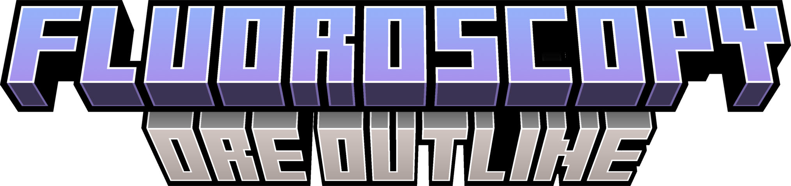
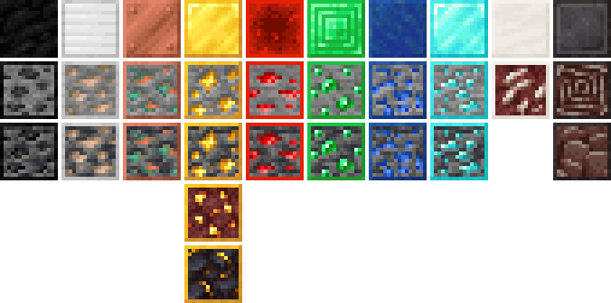

<h1 align="center">
  
</h1>

  

 

A Minecraft Bedrock resource pack that outlines ores with their block color, making them easier to spot while mining.

## Ores

This resource pack adds colored outlines to all ore blocks in Minecraft, including:

- [x] Coal Ore
- [x] Copper Ore
- [x] Iron Ore
- [x] Gold Ore
- [x] Redstone Ore
- [x] Lapis Lazuli Ore
- [x] Diamond Ore
- [x] Emerald Ore
- [x] Ancient Debris
- [x] Nether Gold Ore
- [x] Nether Quartz Ore
- [x] Gilded Blackstone

All deepslate variants are also included with matching outlines.

